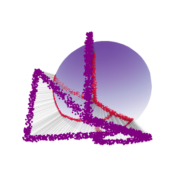

# JNLR Jax-based non-linear reconciliation and learning 

**J-NLR** is a Python library for non-linear reconciliation, learning, and geometric analysis on constraint manifolds. Built on [JAX](https://github.com/google/jax), it leverages automatic differentiation and GPU/TPU acceleration to efficiently project predicted values onto surfaces defined by implicit constraints $f(z) = 0$.

## Key Features

- **Non-linear Reconciliation**: Multiple solvers (Augmented Lagrangian, curvature-aware Newton, vanilla projections) for projecting forecasts onto constraint manifolds
- **SHOULD Analysis**: Curvature-based methods to determine *when* reconciliation is beneficial—verify if RMSE is guaranteed to reduce before applying corrections
- **Manifold Sampling**: Sample from explicit (graph) or implicit manifolds using volume-weighted sampling, Latin hypercube, or Langevin dynamics on the constraint surface
- **Mesh Generation**: Create triangulated meshes from explicit parameterizations for visualization and geodesic computation
- **Geodesics**: Compute geodesic distances and shortest paths on manifolds via exact MMP algorithm or fast graph-based approximations; includes probabilistic scores like pointcloud geodesic distance
- **Visualization**: Interactive 3D rendering of manifolds, projections, and geodesic paths with Plotly
- **JAX-native**: Fully JIT-compiled and vectorized (`vmap`) for high-performance batch processing

## Running the notebooks
If you want to run the notebooks, the suggested way is to install `uv` packet manager, cloning the repo and, from a terminal:
`uv pip install -e .`