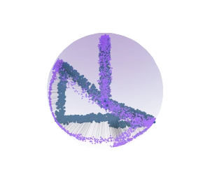
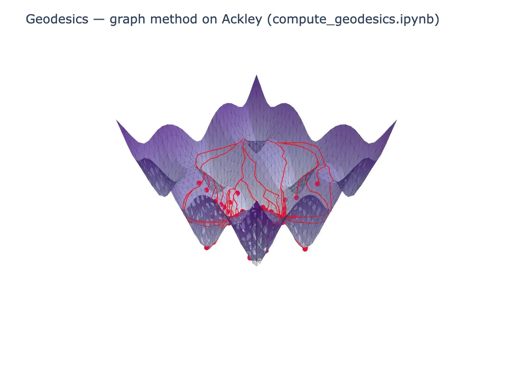

<div style="display:flex;align-items:center;gap:1.2rem;margin-bottom:.5rem;">
  
  <div>
    <h1 style="margin:0;">JNLR</h1>
    <p style="margin:0;font-size:1.15rem;opacity:.85;">JAX-based non-linear reconciliation and learning</p>
  </div>
</div>

**J-NLR** is a Python library for non-linear reconciliation, learning, and geometric analysis on constraint manifolds. Built on [JAX](https://github.com/google/jax), it leverages automatic differentiation and GPU/TPU acceleration to efficiently project predicted values onto surfaces defined by implicit constraints $f(z) = 0$.

<div class="plotly-figure" style="margin-bottom:1rem;">
    <p align="center">
      
    </p>
    <p align="center" style="font-size:.9rem;opacity:.85;margin-top:.35rem;">Example notebooks — geodesics, meshes, projection, and sampling (<code>scripts/render_notebook_spin_reel.py</code>)</p>
</div>

<div class="plotly-figure">
    <p align="center">
      <iframe src="examples/plots/projection_hypersurfaces_fig7.html" loading="lazy" style="width:410px;height:410px;border:none;border-radius:8px;box-shadow:0 2px 8px rgba(0,0,0,0.08);"></iframe>
    </p>
</div>


## Key Features

- **Non-linear Reconciliation**: Multiple solvers (Augmented Lagrangian, curvature-aware Newton, vanilla projections) for projecting forecasts onto constraint manifolds
- **SHOULD Analysis**: Curvature-based methods to determine *when* reconciliation is beneficial—verify if RMSE is guaranteed to reduce before applying corrections
- **Manifold Sampling**: Sample from explicit (graph) or implicit manifolds using volume-weighted sampling, Latin hypercube, or Langevin dynamics on the constraint surface
- **Mesh Generation**: Create triangulated meshes from explicit parameterizations for visualization and geodesic computation
- **Geodesics**: Compute geodesic distances and shortest paths on manifolds via exact MMP algorithm or fast graph-based approximations; includes probabilistic scores like pointcloud geodesic distance
- **Visualization**: Interactive 3D rendering of manifolds, projections, and geodesic paths with Plotly
- **JAX-native**: Fully JIT-compiled and vectorized (`vmap`) for high-performance batch processing

## API Documentation

Explore the full API reference:

- [**Reconcile**](api/reconcile.md) - Non-linear reconciliation solvers
- [**Should**](api/should.md) - SHOULD analysis for curvature-based decision making
- [**Stats**](api/stats.md) - Statistical utilities
- [**Curvature Utils**](api/curvature_utils.md) - Curvature computation utilities

## Installation

Install using `uv` package manager:

```bash
uv pip install -e .
```

Or with pip:

```bash
pip install jnlr
```

## Citation

If you use **JNLR** in academic work, please cite the associated paper:

Lorenzo Nespoli, Anubhab Biswas, Roberto Rocchetta, and Vasco Medici.  
"Nonlinear reconciliation: Error reduction theorems."  
Transactions on Machine Learning Research (TMLR), 2026.  
OpenReview: [https://openreview.net/forum?id=dXRWuogm3J](https://openreview.net/forum?id=dXRWuogm3J)

### BibTeX

```bibtex
@article{nespoli2026nonlinear_reconciliation,
  title   = {Nonlinear reconciliation: Error reduction theorems},
  author  = {Nespoli, Lorenzo and Biswas, Anubhab and Rocchetta, Roberto and Medici, Vasco},
  journal = {Transactions on Machine Learning Research},
  year    = {2026},
  url     = {https://openreview.net/forum?id=dXRWuogm3J},
  note    = {Accepted by TMLR}
}
```

## Acknowledgements

This work has been funded by the Swiss State Secretariat for Education, Research and Innovation (SERI) under the Swiss contribution to the Horizon Europe projects DR-RISE (Horizon Europe, Grant Agreement No. 101104154) and REEFLEX (Horizon Europe, Grant Agreement No. 101096192).
